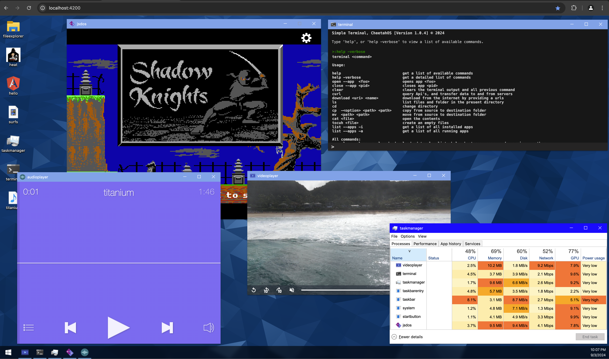

# CheetahOs

Building a Dektop environment in the web browser

This project was generated with [Angular CLI](https://github.com/angular/angular-cli) version 18.0.0.

## Development server
Run `npm install` to install all the needed pacakges

Run `npm run build` to generate the filesystem(index.json). index.json is present, so this step can be skipped.

Run `ng serve` for a dev server. Navigate to `http://localhost:4200/`. The application will automatically reload if you change any of the source files.

## Further help

To get more help on the Angular CLI use `ng help` or go check out the [Angular CLI Overview and Command Reference](https://angular.io/cli) page.
